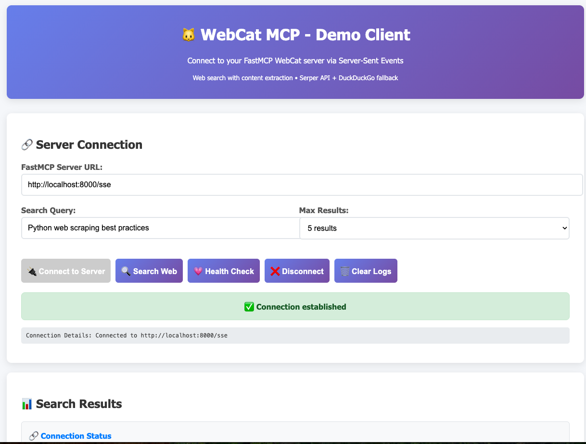

# WebCat MCP Server

**Web search and content extraction for AI models via Model Context Protocol (MCP)**

[](https://github.com/Kode-Rex/webcat)
[](https://hub.docker.com/r/tmfrisinger/webcat)
[](LICENSE)

## Quick Start

```bash
# Run WebCat with Docker (30 seconds to working demo)
docker run -p 8000:8000 tmfrisinger/webcat:latest

# Open demo client
open http://localhost:8000/demo
```



## What is WebCat?

WebCat is an **MCP (Model Context Protocol) server** that provides AI models with:
- 🔍 **Web Search** - Serper API (premium) or DuckDuckGo (free)
- 📄 **Content Extraction** - Clean markdown conversion with Trafilatura
- 🌐 **SSE Streaming** - Real-time results via Server-Sent Events
- 🎨 **Demo UI** - Interactive testing interface

Built with **FastAPI** and **FastMCP** for seamless AI integration.

## Features

- ✅ **No Authentication Required** - Simple setup
- ✅ **Automatic Fallback** - Serper API → DuckDuckGo if needed
- ✅ **Smart Content Extraction** - Trafilatura removes navigation/ads/chrome
- ✅ **MCP Compliant** - Works with Claude Desktop, LiteLLM, etc.
- ✅ **Rate Limited** - Configurable protection
- ✅ **Docker Ready** - One command deployment
- ✅ **Parallel Processing** - Fast concurrent scraping

## Installation & Usage

### Docker (Recommended)

```bash
# With Serper API (best results)
docker run -p 8000:8000 -e SERPER_API_KEY=your_key tmfrisinger/webcat:2.2.0

# Free tier (DuckDuckGo only)
docker run -p 8000:8000 tmfrisinger/webcat:2.2.0

# Custom configuration
docker run -p 9000:9000 \
  -e PORT=9000 \
  -e SERPER_API_KEY=your_key \
  -e RATE_LIMIT_WINDOW=60 \
  -e RATE_LIMIT_MAX_REQUESTS=10 \
  tmfrisinger/webcat:2.2.0
```

### Local Development

```bash
cd docker
python -m pip install -e ".[dev]"

# Start MCP server
python mcp_server.py

# Or start demo server with UI
python simple_demo.py
```

## Available Endpoints

| Endpoint | Description |
|----------|-------------|
| `http://localhost:8000/demo` | 🎨 Interactive demo UI |
| `http://localhost:8000/health` | 💗 Health check |
| `http://localhost:8000/status` | 📊 Server status |
| `http://localhost:8000/mcp` | 🛠️ MCP protocol endpoint |
| `http://localhost:8000/sse` | 🔗 SSE streaming |

## Configuration

### Environment Variables

| Variable | Default | Description |
|----------|---------|-------------|
| `SERPER_API_KEY` | *(none)* | Serper API key for premium search (optional) |
| `PORT` | `8000` | Server port |
| `LOG_LEVEL` | `INFO` | Logging level (DEBUG, INFO, WARNING, ERROR) |
| `LOG_DIR` | `/tmp` | Log file directory |
| `RATE_LIMIT_WINDOW` | `60` | Rate limit window in seconds |
| `RATE_LIMIT_MAX_REQUESTS` | `10` | Max requests per window |

### Get a Serper API Key

1. Visit [serper.dev](https://serper.dev)
2. Sign up for free tier (2,500 searches/month)
3. Copy your API key
4. Pass to Docker: `-e SERPER_API_KEY=your_key`

## MCP Tools

WebCat exposes these tools via MCP:

| Tool | Description | Parameters |
|------|-------------|------------|
| `search` | Search web and extract content | `query: str`, `max_results: int` |
| `scrape_url` | Scrape specific URL | `url: str` |
| `health_check` | Check server health | *(none)* |
| `get_server_info` | Get server capabilities | *(none)* |

## Architecture

```
MCP Client (Claude, LiteLLM)
    ↓
FastMCP Server (SSE Transport)
    ↓
Search Decision
    ├─ Serper API (premium) → Content Scraper
    └─ DuckDuckGo (free)    → Content Scraper
                                    ↓
                            Trafilatura (markdown)
                                    ↓
                            Structured Response
```

## Testing

```bash
cd docker

# Run all tests
python -m pytest tests/unit -v

# With coverage
python -m pytest tests/unit --cov=. --cov-report=term --cov-report=html

# CI-safe (no external dependencies)
python -m pytest -v -m "not integration"
```

**Current test coverage:** 70%+ across all modules

## Development

```bash
# Install with dev dependencies
pip install -e ".[dev]"

# Format code
make format

# Lint code
make lint

# Run tests
make test

# Full CI check
make ci
```

## Project Structure

```
docker/
├── mcp_server.py          # Main MCP server
├── simple_demo.py         # Demo server with UI
├── clients/               # Serper & DuckDuckGo clients
├── services/              # Content scraping & search
├── tools/                 # MCP tool implementations
├── models/                # Pydantic data models
│   ├── domain/           # Domain entities
│   └── responses/        # API responses
├── endpoints/            # FastAPI endpoints
└── tests/                # Comprehensive test suite
```

## Search Quality Comparison

| Feature | Serper API | DuckDuckGo |
|---------|------------|------------|
| **Cost** | Paid (free tier available) | Free |
| **Quality** | ⭐⭐⭐⭐⭐ Excellent | ⭐⭐⭐⭐ Good |
| **Coverage** | Comprehensive (Google-powered) | Standard |
| **Speed** | Fast | Fast |
| **Rate Limits** | 2,500/month (free tier) | None |

## Limitations

- **Text-focused:** Optimized for article content, not multimedia
- **Rate limits:** Respects configured limits to prevent abuse
- **No JavaScript:** Cannot scrape dynamic JS-rendered content
- **PDF support:** Detection only, not full extraction

## Contributing

Contributions welcome! Please:

1. Fork the repository
2. Create a feature branch
3. Add tests for new functionality
4. Ensure `make ci` passes
5. Submit a Pull Request

See [CLAUDE.md](CLAUDE.md) for development guidelines and architecture standards.

## License

MIT License - see [LICENSE](LICENSE) file for details.

## Links

- **GitHub:** [github.com/Kode-Rex/webcat](https://github.com/Kode-Rex/webcat)
- **Docker Hub:** [hub.docker.com/r/tmfrisinger/webcat](https://hub.docker.com/r/tmfrisinger/webcat)
- **MCP Spec:** [modelcontextprotocol.io](https://modelcontextprotocol.io)
- **Serper API:** [serper.dev](https://serper.dev)

---

**Version 2.2.0** | Built with ❤️ using FastMCP, FastAPI, and Trafilatura
